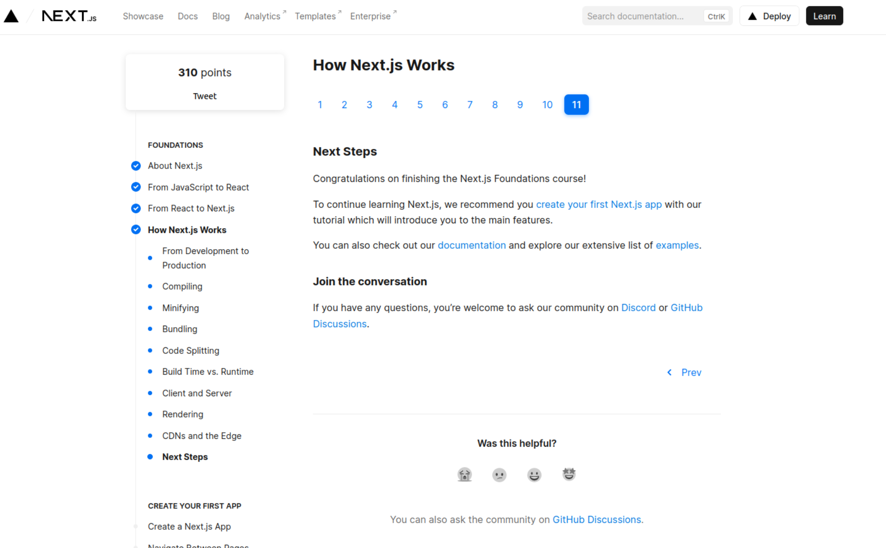

  <h1 style="margin-top: -20px">Next.js Foundations Course</h1>
    
by Andrew Tite, Full-Stack Developer, Webonise Lab

I have completed the Next.js Foundations course by [NextJS.org](https://nextjs.org/learn/foundations/how-nextjs-works).

Topics included:
- About Next.js
- From JavaScript to React
- From React to Next.js
- How Next.js Works

## Navigating the Branches

Each branch is a checkpoint in the course. The branches are named after the lesson they represent:

- Branch: **main**

    This is the primary branch of this repo.

- Branch: **1-DOM**

    This branch represents the lessons:
    - [x] [About Next.js: What is Next.js?](https://nextjs.org/learn/foundations/about-nextjs) 
    - [x] [From JavaScript to Next.ks: Updating the UI with JavaScript and DOM Methods](https://nextjs.org/learn/foundations/from-javascript-to-react/updating-ui-with-javascript)

- Branch: **2-React**

    This branch represents the lessons:
    - [x] [From JavaScript to React: Getting Started with React](https://nextjs.org/learn/foundations/from-javascript-to-react/getting-started-with-react)
    - [x] [From JavaScript to React: Essential JavaScript for React](https://nextjs.org/learn/foundations/from-javascript-to-react/essential-javascript-react)
    - [x] [From JavaScript to React: React Core Concepts](https://nextjs.org/learn/foundations/from-javascript-to-react/react-core-concepts)

- Branch: **3-Components**

    This branch represents the lesson:
    - [x] [From JavaScript to React: Building UI with Components](https://nextjs.org/learn/foundations/from-javascript-to-react/building-ui-with-components)
   
- Branch: **4-Props**

    This branch represents the lesson:
    - [x] [From JavaScript to React: Displaying Data with Props](https://nextjs.org/learn/foundations/from-javascript-to-react/displaying-data-with-props)

- Branch: **5-State**

    This branch represents the lesson:
    - [x] [From JavaScript to React: Adding Interactivity with State](https://nextjs.org/learn/foundations/from-javascript-to-react/adding-interactivity-with-state)
    
- Branch: **6-React-to-Nextjs**

    This branch represents the lessons:
    - [x] [Getting Started with Next.js](https://nextjs.org/learn/foundations/from-react-to-nextjs/getting-started-with-nextjs)
    - [x] [How Next.js Works](https://nextjs.org/learn/foundations/how-nextjs-works/development-and-production)
    - [x] [What is Compiling?](https://nextjs.org/learn/foundations/how-nextjs-works/compiling)
    - [x] [What is Minifying?](https://nextjs.org/learn/foundations/how-nextjs-works/minifying)
    - [x] [What is Bundling?](https://nextjs.org/learn/foundations/how-nextjs-works/bundling)
    - [x] [What is Code Splitting?](https://nextjs.org/learn/foundations/how-nextjs-works/code-splitting)
    - [x] [Build Time vs. Runtime](https://nextjs.org/learn/foundations/how-nextjs-works/buildtime-and-runtime)
    - [x] [Client and Server](https://nextjs.org/learn/foundations/how-nextjs-works/client-and-server)
    - [x] [What is Rendering?](https://nextjs.org/learn/foundations/how-nextjs-works/rendering)
    - [x] [CDNs and the Edge Network](https://nextjs.org/learn/foundations/how-nextjs-works/cdns-and-edge)
  

